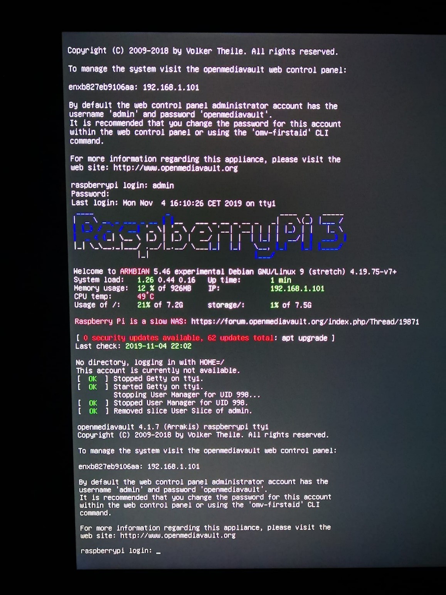
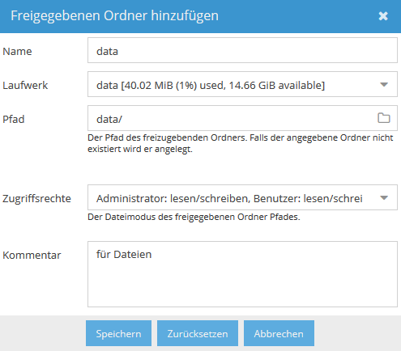
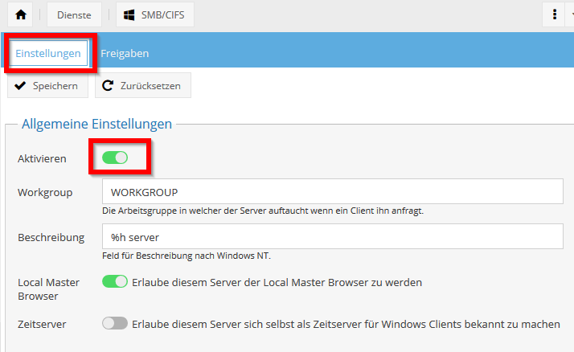

# Serviceauftrag RasPi-Werkstatt: NAS Pi - Lehrer
```
+--Dokumentation Lehrer-------------------+
! Autoren: Severin Sieber | Roman Signer  !
+-----------------------------------------+
! Version: 2.0                            !
+-----------------------------------------+
```
## Inhaltsverzeichnis
- [Serviceauftrag RasPi-Werkstatt: NAS Pi - Lehrer](#serviceauftrag-raspi-werkstatt-nas-pi---lehrer)
  - [Inhaltsverzeichnis](#inhaltsverzeichnis)
  - [01 Servicebeschrieb](#01-servicebeschrieb)
    - [01.1 Funktionen](#011-funktionen)
  - [02 Voraussetzungen](#02-voraussetzungen)
    - [02.1 Hardware](#021-hardware)
    - [02.2 Software](#022-software)
  - [03 Installationsanleitung](#03-installationsanleitung)
    - [03.1 Installation von OpenMediaVault](#031-installation-von-openmediavault)
    - [03.2 Anmeldung & Erste Schritte](#032-anmeldung--erste-schritte)
    - [03.3 Datenspeicher & Freigegebene Ordner](#033-datenspeicher--freigegebene-ordner)
    - [03.4 Dienste](#034-dienste)
    - [03.5 Benutzer und Gruppen](#035-benutzer-und-gruppen)
    - [03.6 RAID](#036-raid)
    - [03.7 Plugins](#037-plugins)
  - [04 Testing](#04-testing)
    - [04.1 Testprotokoll](#041-testprotokoll)
  - [05 Quellen](#05-quellen)

## 01 Servicebeschrieb
Mithilfe unseres Serviceauftrags haben die Lernenden die Möglichkeit ein eigenes kompaktes und portables NAS auf einem Raspberry Pi aufzusetzen. Der Auftrag ist vor allem an Anfänger gerichtet und bietet einen soliden Einstieg in die zentrale Dateispeicherung im privaten Bereich.  

### 01.1 Funktionen
-	Speichern und Verwalten von Dateien
-	Fernzugriff über FTP, TFTP, SMB, NFS und SNMP
-	Datensicherung mit Rsync: welche Verzeichnisse werden gesichert, welche nicht
-	Plug-ins: Virenscanner (?)  

## 02 Voraussetzungen
Die von uns gewählte Variante für den eigenen NAS-Server ist unkompliziert, kostengünstig und setzt wenig voraus.  

### 02.1 Hardware
| Material | Funktionalität |
|:---------|:---------------|
| Raspberry Pi 2 / Raspberry Pi 3 / Raspberry Pi 4 | Einplatinencomputer – Funktion als NAS-Server |
| microSD-Karte	| Speicherkarte auf der sich das OS-Image befindet |
| microSD-Kartenleser	| Zum Schreiben des Images auf die microSD-Karte |
| USB-Stick / USB-Festplatte |	Zur Dateiablage |
| Gerät für Verbindungsaufbau zum Raspi	| Am besten eignet sich hierfür ein Notebook |
| evt. Tastatur | Für den direkten Anschluss ans Raspi falls notwendig |
| evt. Monitor | Ebenfalls für den direkten Anschluss ans Raspi falls notwendig |

### 02.2 Software
| Name |	Funktionalität |	Mindestanforderungen |
|:-----|:----------------|:----------------------|
| OpenMediaVault<sub>[1](#1)</sub>	| Open Source NAS-Server-Software |	CPU: 500MHz Pentium 3 <br> RAM: 128MB <br> Speicherplatz: 2GB |
| Win32 Disk Imager (Windows)<sub>[2](#2)</sub> <br> ApplePi-Baker v2 (macOS)<sub>[3](#3)</sub> | Software zum beschreiben (flashen) der microSD-Karte | Windows / Mac Client |
| Angry IP Scanner<sub>[4](#4)</sub>	| Software zur Aufspürung des Raspberry Pis |	Windows / Mac Client |
| Browser (Chrome, Firefox, Edge, etc.) |	Zugriff auf das OpenMediaVault Webinterface	| Windows / Mac Client |


## 03 Installationsanleitung

### 03.1 Installation von OpenMediaVault  
Die Installation von OpenMediaVault gestaltet sich sehr simpel. Das heruntergeladene Image muss nur noch auf eine microSD-Karte geschrieben werden.
Wenn man den Raspi mit der angesteckten microSD-Karte startet, bootet OpenMediaVault automatisch. Um nun an die IP für den Zugriff auf das Webinterface zu gelangen, kann man entweder einen Monitor an den Raspberry Pi anschliessen oder diese via IP-Scanner Software ermitteln.  
  
    
    
### 03.2 Anmeldung & Erste Schritte  
OpenMediaVault wird direkt in einem Browser über das Webinterface konfiguriert. Der Zugriff erfolgt über die Eingabe der ermittelten IP-Adresse in der Adressleiste des Browsers.  
Der Benutzername lautet standardmässig **admin** und das Passwort **openmediavault**.  
  
    
  
Nach der ersten Anmeldung ist es zu empfehlen das Passwort in den allgemeinen Einstellungen und die Zeitzone in Datum & Zeit zu ändern.  
  
    
  
    
    
### 03.3 Datenspeicher & Freigegebene Ordner  
Ein NAS ohne genügend Speicherplatz für eine Dateiablage wäre natürlich unbrauchbar. Deshalb wird nun das gewählte Speichermedium, zum Beispiel ein USB-Stick oder eine USB-Festplatte, an den Raspberry Pi angeschlossen und die vorhandene Partition in OpenMediaVault eingebunden. Vorher wird empfohlen den angeschlossenen Datenträger über *Datenspeicher* -> *Laufwerke* zu bereinigen.  
  
    
    
Im Anschluss kann via *Dateisystem* eine neue Partition angelegt werden.  
**Wichtig!** Nach dem anlegen der Partition wählt man diese aus und klickt auf ein *Einbinden* -> *Änderung aktiv machen*.  
  
    
    
Um die angelegte Partition nun freizugeben, wird diese via Freigegebene Ordner hinzugefügt.  
**Wichtig!** Auch hier nicht vergessen mit einem Klick auf *Änderung aktiv machen* die Änderungen zu bestätigen.  
  
    
    
### 03.4 Dienste  
Damit auf die freigegeben Ordner via Windows zugegriffen werden kann, muss der SMB/CIFS Dienst (*Dienste* -> *SMB/CIFS* -> *Einstellungen*) aktiviert werden.  
  
    
    
Den Dienst nur zu aktivieren reicht allerdings nicht aus. Dieser muss für die gewünschte Partition freigegeben (*Dienste* -> *SMB/CIFS* -> *Freigaben* -> *Hinzufügen*) werden.  
  
    
    

### 03.5 Benutzer und Gruppen   
Bei einem NAS auf welches mehrere Benutzer Zugriff haben sollen, ist wichtig die entsprechenden Berechtigungen festzulegen. Es wäre möglicherweise vorteilhaft wenn nicht alle User, die auf das NAS zugreifen, einen Blick in die Steuerunterlagen von Hans Muster werfen können. Dafür bietet OpenMediaVault eine einfache Konfiguration von Benutzer und Gruppen.  

Neue Benutzer können unter der *Zugriffskontrolle* -> *Benutzer* erstellt werden.  
  
    
    
Möchte man mit dem erstellten Benutzer ohne Gruppenzugehörigkeit direkt arbeiten, ist die Einstellung *nur Gäste* auf *Nein* zu ändern.  
Es lohnt sich jedoch vor allem aus Verwaltungsgründen Gruppen zu erstellen. So sind die gewünschten Berechtigungen nicht für jeden Benutzer einzeln festzulegen, sondern können direkt auf die Gruppe angewendet werden.  

Neue Gruppen können unter der *Zugriffskontrolle* -> *Gruppe* erstellt werden. Während der Erstellung werden bereits erstellte Benutzer unter dem Reiter *Mitglieder* der Gruppe hinzugefügt.  
  
    
    
Im Anschluss sind nur noch die Privilegien der Gruppen festzulegen.  
  
    
    
### 03.6 RAID
OpenMediaVault bietet die Option einer RAID-Erstellung an, sofern zwei Datenträger verbunden sind. Zur Erhöhung der Datensicherheit empfiehlt sich das Level *Mirror*, welches einem RAID 1 Verbund entspricht. Ein RAID kann unter *Datenspeicher* -> *RAID Verwaltung* erstellt werden.  
  
    
    
### 03.7 Plugins  
Für OpenMediaVault gibt es viele verschiedene Erweiterungen. Je nach Nutzungszweck sind einige sehr zu empfehlen und nützlich.
 
- Mit dem fail2ban Plug-in wird sichergestellt, dass das WebGUI trotz Forwarding ins Internet sicher ist.  
- Dank eines Backup Plugins können regelmässige Backups gezogen werden um die Daten zu sichern.  
- Ausserdem gibt es auch ein WebDav Plug-in, welches Dateien übers Internet freigeben kann.  

Dies ist legidlich eine kleine Auswahl an Plugins, um den Umfang von OpenMediaVault aufzuzeigen.


## 04 Testing
### 04.1 Testprotokoll
| Was | Soll | Ist | i.O. |
|:---------|:---------------|:-----|:-----|
| NAS Pi als Gast verwenden | Freigegebene Ordner für Gäste können ohne Login gesehen und verwendet werden |  |   |  
| NAS Pi als Benutzer verwenden | Freigegebene Ordner für Benutzer können nur mit Login gesehen und verwendet werden |  |  |  
| Benutzer an Gruppen hinzufügen | Benutzer können Gruppen hinzugefügt werden und übernehmen die entsprechenden Zugriffsrechte |  |  |  
| RAID / Mirroring funktioniert | USB Sticks werden gespiegelt |  |  |  


## 05 Quellen
*<a name="1">1</a>* https://www.openmediavault.org/  
*<a name="2">2</a>* https://sourceforge.net/projects/win32diskimager/files/latest/download  
*<a name="3">3</a>*	https://www.tweaking4all.com/hardware/raspberry-pi/applepi-baker-v2/#InstallingApplePiBaker  
*<a name="4">4</a>*	https://angryip.org/download/